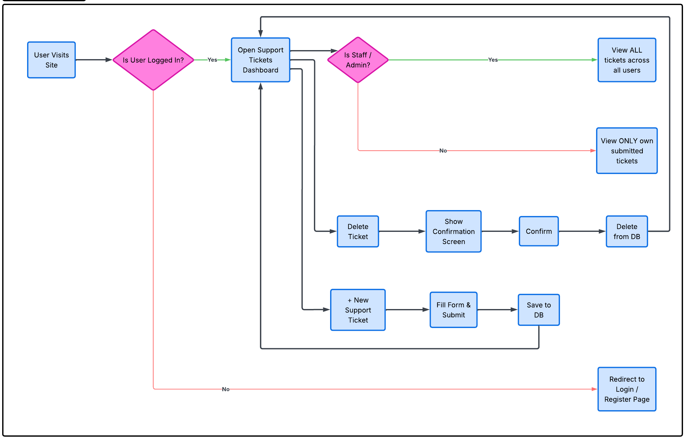
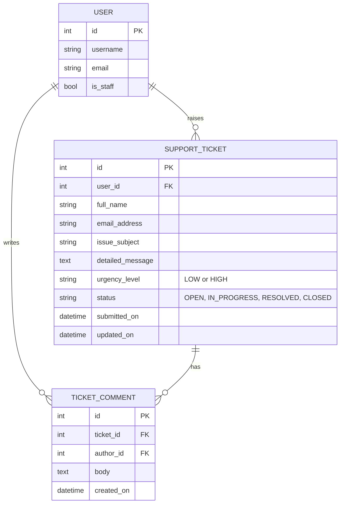

**Author:** Mlamleli Ngobese
**Portfolio Project:** Portfolio Project 4 (Full-Stack Toolkit), Code Institute Diploma in Full Stack Software Development

# TicketSync

TicketSync is a full-stack Django support-ticket portal. Registered users raise support tickets, follow each ticket's progress from **Open** to **Resolved**, and talk to the support team in a reply thread on the ticket itself. Support staff see every ticket, change its status and reply to users.

👉 **[Live application on Heroku](https://ticketsync-257c307d6ac3.herokuapp.com/)**
👉 **[GitHub Project board (Agile Kanban)](https://github.com/users/mlamleli85/projects/5)**

---

## Contents

1. [Purpose and target audience](#purpose-and-target-audience)
2. [User experience (UX) design](#user-experience-ux-design)
3. [Agile development](#agile-development)
4. [User stories](#user-stories)
5. [Features](#features)
6. [Data model](#data-model)
7. [Security and permissions](#security-and-permissions)
8. [Testing](#testing)
9. [Bugs](#bugs)
10. [Deployment](#deployment)
11. [Technologies used](#technologies-used)
12. [Credits](#credits)

---

## Purpose and target audience

Small teams often handle support requests through email, where messages get lost and users never know whether anyone is working on their problem. TicketSync gives both sides one place to work:

- **Users** (customers or employees who need help) can describe a problem once, see its current status at any time, and reply on the same page.
- **Support staff** see every ticket in one dashboard, can spot urgent tickets that have been waiting too long, and update the status as they work.

The home page explains this to first-time visitors and offers clear **Register** and **Log in** buttons, so the purpose of the site is obvious before signing up.

---

## User experience (UX) design

### Logic flowchart

The flowchart below was created during planning. It outlines the user flow, the authentication logic and the CRUD loops:



### Site structure

| Page | URL | Who can access it |
| :--- | :--- | :--- |
| Home | `/` | Everyone |
| Register | `/accounts/signup/` | Visitors who are not logged in |
| Log in | `/accounts/login/` | Visitors who are not logged in |
| My Tickets (dashboard) | `/tickets/` | Logged-in users |
| New ticket | `/tickets/new/` | Logged-in users |
| Ticket detail and replies | `/tickets/<id>/` | Ticket owner and staff |
| Edit ticket | `/tickets/<id>/edit/` | Ticket owner (while active) and staff |
| Delete ticket | `/tickets/<id>/delete/` | Ticket owner and staff |
| Admin panel | `/admin/` | Superusers only |

### Navigation

Every page shares one base template (`templates/base.html`) with a responsive navigation bar. It collapses into a menu on small screens. The bar always shows:

- links to **Home**, **My Tickets** and **New Ticket** (the ticket links only appear once logged in);
- the user's **login status** ("Logged in as *username*", with a **Staff** badge for support staff) or "Not logged in";
- **Log in** and **Register** buttons, or a **Log out** button.

Breadcrumbs on the ticket pages show where the user is and link back to the dashboard.

### Visual design

- **Colours:** a deep teal brand colour (`#1f4e5f`) for the navigation bar and main buttons gives a calm, professional feel suited to a support tool. An amber accent (`#f2a541`) marks urgent tickets that need attention. Each ticket status has its own badge colour: blue for Open, purple for In Progress, green for Resolved and grey for Closed. Users can read a ticket's state at a glance.
- **Typography:** Bootstrap's native system font stack, for fast loading and good readability on every device.
- **Layout:** Bootstrap 5's grid makes every page responsive, from 320px phones to wide desktop screens. On small screens the ticket table scrolls sideways inside its card, and the action buttons shrink to icons.
- **Feedback:** every action (register, log in, log out, create, update, delete, reply) shows a coloured message. Success messages close by themselves after five seconds; error messages stay until the user closes them.

---

## Agile development

The project was planned and tracked with the **[TicketSync GitHub Project board](https://github.com/users/mlamleli85/projects/5)**, using a Kanban layout with the columns **Backlog → To Do → In Progress → Done**.

- Every user story is a GitHub Issue that uses a user story template with **acceptance criteria** and **tasks**.
- Each story is labelled with its **epic** and a **MoSCoW priority** (`must-have`, `should-have`, `could-have`).
- Stories are grouped into **milestones**, one per sprint:

| Sprint (milestone) | Goal | Stories |
| :--- | :--- | :--- |
| Sprint 1: Foundations | Project set-up, data model, admin | US01, US02 |
| Sprint 2: Ticket CRUD | Create, read, update and delete tickets with feedback messages | US03 – US07 |
| Sprint 3: Accounts and permissions | Registration, login/logout, login status, access control | US08 – US11 |
| Sprint 4: Collaboration and quality | Replies, status workflow, search, testing and documentation | US12 – US16 |

---

## User stories

### Epic 1: Project foundations

**US01 (must-have):** As a **developer**, I can **set up a Django project deployed to Heroku** so that **the app is available online from the start**.

- Acceptance criteria: the app is deployed to Heroku; secrets are stored in environment variables, not in the repository; `DEBUG` is off in production.

**US02 (must-have):** As a **site admin**, I can **manage tickets in the Django admin panel** so that **I can fix data problems quickly**.

- Acceptance criteria: tickets and replies are listed, searchable and filterable by status and urgency; a ticket's status can be changed from the list.

### Epic 2: Ticket management (CRUD)

**US03 (must-have):** As a **user**, I can **submit a support ticket** so that **I can get help with my issue**.

- Acceptance criteria: the form asks for name, email, subject, description and urgency; invalid input shows an error next to the field; the new ticket is linked to my account.

**US04 (must-have):** As a **user**, I can **see a list of my tickets** so that **I know what I have raised**.

- Acceptance criteria: the dashboard lists only my tickets, newest first, with urgency, status and date.

**US05 (must-have):** As a **user**, I can **open a ticket to see its full details** so that **I can check what I reported and its status**.

**US06 (must-have):** As a **user**, I can **edit my ticket** so that **I can correct or add information**.

- Acceptance criteria: the edit form opens pre-filled with the current values; changes are saved and confirmed with a message; resolved or closed tickets can no longer be edited.

**US07 (must-have):** As a **user**, I can **delete my ticket** so that **I can remove a request I no longer need**.

- Acceptance criteria: I am asked to confirm before anything is deleted; a message confirms the deletion.

### Epic 3: Accounts and permissions

**US08 (must-have):** As a **visitor**, I can **register an account** so that **my tickets are private to me**.

- Acceptance criteria: registration asks for a username, email and password; an email address can only be used once; I am logged in straight after registering.

**US09 (must-have):** As a **user**, I can **log in and log out** so that **my account is secure**.

**US10 (must-have):** As a **user**, I can **see whether I am logged in** so that **I know which account I am using**.

- Acceptance criteria: the navigation bar shows "Logged in as *username*" or "Not logged in" on every page.

**US11 (must-have):** As a **user**, I can **only see and change my own tickets** so that **my information stays private**.

- Acceptance criteria: logged-out visitors are sent to the login page; opening another user's ticket by typing its URL shows a "not found" page.

### Epic 4: Collaboration and workflow

**US12 (should-have):** As a **support staff member**, I can **see all tickets and change their status** so that **I can manage the support queue**.

**US13 (should-have):** As a **user or staff member**, I can **reply on a ticket** so that **we can discuss the issue in one place**.

- Acceptance criteria: replies appear in order under the ticket; a staff reply moves an Open ticket to In Progress; a user reply reopens a Resolved ticket; closed tickets accept no replies.

**US14 (should-have):** As a **user**, I can **search and filter my tickets by status** so that **I can find a ticket quickly**.

**US15 (could-have):** As a **support staff member**, I can **spot urgent tickets that have been open for over a day** so that **nothing urgent is forgotten**.

**US16 (could-have):** As a **user**, I can **see how many more characters my description needs** so that **I fill in the form correctly the first time**.

---

## Features

### Home page

- Explains what TicketSync does in three steps, with Register and Log in buttons for visitors.
- Logged-in users see a summary of their tickets (total, active, resolved) and shortcut buttons.

### Registration, login and logout

- Front-end registration with username, email and password (with Django's password strength checks). Duplicate email addresses are rejected.
- Front-end login page. Users never have to use the Django admin.
- Logout is a button that sends a POST request, so a link or image can't log a user out by accident.

### Ticket dashboard (Read)

- Lists the user's tickets (staff see all tickets, plus who raised each one).
- Summary counts for each status.
- Search by subject or description, and filter by status.
- Urgent tickets that are still open after a day are highlighted with a **Needs attention** badge.

### Create a ticket (Create)

- Name and email are pre-filled from the user's account.
- Server-side validation: names may only contain letters, spaces, hyphens, apostrophes and full stops; the subject needs at least 5 characters and the description at least 20. A user can't open a second active ticket with the same subject (this catches double submissions).
- A live character counter (JavaScript) shows how many more characters the description needs.

### Ticket detail and replies

- Full ticket details, status and urgency badges, submitted and last-updated dates.
- Reply thread with staff replies highlighted. Replies change the status automatically (see US13).

### Edit a ticket (Update)

- The form opens pre-filled with the ticket's current data.
- Staff can also change the status. Owners can't edit a ticket once it is resolved or closed; they are told to add a reply instead.

### Delete a ticket (Delete)

- A confirmation page names the ticket before deleting it and its replies.

### Messages

- Every create, update, delete, reply, login, logout and registration action shows a success or error message.

### Custom 404 page

- Matches the site design and links back to the home page.

### Possible future features

- Email notifications when a ticket's status changes.
- File attachments (for example, screenshots) on tickets.
- Assigning tickets to a specific staff member.

---

## Data model

TicketSync uses PostgreSQL in production and SQLite locally. Besides Django's built-in `User` model, it has two custom models.



### SupportTicket

| Field | Type | Notes |
| :--- | :--- | :--- |
| `user` | ForeignKey → User | The ticket's owner. Deleting the user deletes their tickets. |
| `full_name` | CharField(150) | Validated to letters and common name punctuation |
| `email_address` | EmailField | Pre-filled from the account |
| `issue_subject` | CharField(200) | At least 5 characters |
| `detailed_message` | TextField | At least 20 characters |
| `urgency_level` | CharField, choices | `LOW` (General Inquiry) or `HIGH` (Urgent Issue) |
| `status` | CharField, choices | `OPEN` (default), `IN_PROGRESS`, `RESOLVED`, `CLOSED` |
| `submitted_on` | DateTimeField | Set automatically on creation |
| `updated_on` | DateTimeField | Updated automatically on every save |

The business rules live on the model, so every view applies them the same way:

- `can_be_viewed_by`, `can_be_edited_by`, `can_be_deleted_by`: permission checks for owners and staff.
- `apply_comment_rules`: a staff reply moves an Open ticket to In Progress; an owner's reply reopens a Resolved ticket.
- `needs_attention`: true for urgent tickets still open after more than a day.

### TicketComment

| Field | Type | Notes |
| :--- | :--- | :--- |
| `ticket` | ForeignKey → SupportTicket | Deleting a ticket deletes its replies |
| `author` | ForeignKey → User | Owner or staff member who wrote the reply |
| `body` | TextField | Empty replies are rejected |
| `created_on` | DateTimeField | Replies are shown oldest first |

---

## Security and permissions

- **Secrets:** `SECRET_KEY` and `DATABASE_URL` are read from environment variables. Locally they live in an untracked `.env` file (see `.env.example`); on Heroku they are Config Vars. A `.env` file containing an old secret key was committed by mistake early in the project. It was removed from the entire git history and the key was replaced with a new one (see [Bugs](#bugs)).
- **DEBUG** defaults to `False` and is only turned on locally through `.env`.
- **Authentication:** every ticket page uses `@login_required`; logged-out visitors are redirected to the login page.
- **Authorisation:** tickets are always fetched through a query limited to the current user (or all tickets for staff). Typing the URL of another user's ticket returns a 404 page, so users can't even confirm that the ticket exists.
- **CSRF protection** on every form, including logout.
- **Passwords** are checked with Django's password validators and stored hashed.

---

## Testing

### Automated tests

Automated tests are written with Django's `TestCase` in `tickets/tests.py`. They cover:

| Area | What is tested |
| :--- | :--- |
| Models | String output, default status, permission helpers, reply status rules, "needs attention" flag, cascade delete of replies |
| Forms | Required fields, subject/message length, name characters, email format, duplicate active tickets, staff-only status field, duplicate email on registration |
| Authentication | Public home page, login status display, registration, login with valid and invalid details, POST-only logout, redirect of logged-out users from every ticket page |
| CRUD views | Create (and pre-filled form), list filtered per user, staff sees all, search and status filter, detail access control, pre-filled update form, update, staff status change, blocked edit of resolved tickets, delete confirmation and delete, blocked access to other users' tickets |
| Replies | Owner reply, staff reply changes status, no replies on closed tickets, empty reply rejected |

To run the tests locally:

```bash
python manage.py test
```

Result: **TO TEST** (record the number of tests and "OK" here after running them).

### Manual testing

Each test below was carried out on the deployed site.

| # | Feature | Steps | Expected result | Result |
| :- | :--- | :--- | :--- | :--- |
| 1 | Home page (logged out) | Open `/` in a private window | Purpose of the site, "Not logged in" and Register/Log in buttons are shown | TO TEST |
| 2 | Registration | Click Register, fill in a new username, email and matching passwords | Account is created, user is logged in, success message, dashboard opens | TO TEST |
| 3 | Registration validation | Register with an email that is already used, or passwords that don't match | Form shows the error next to the field; no account is created | TO TEST |
| 4 | Login status | Log in | Navbar shows "Logged in as *username*" on every page | TO TEST |
| 5 | Login with wrong password | Enter a wrong password | "Login failed" message; user stays logged out | TO TEST |
| 6 | Logout | Click Log out | User is logged out, "You have been logged out" message, home page opens | TO TEST |
| 7 | Protected pages | While logged out, type `/tickets/`, `/tickets/new/` and `/tickets/1/edit/` in the address bar | Each redirects to the login page | TO TEST |
| 8 | Create ticket | Click New Ticket, fill in valid details, submit | Ticket detail page opens with "submitted successfully" message | TO TEST |
| 9 | Create ticket validation | Submit with a 2-letter subject, a short description, or numbers in the name | The ticket isn't saved; each problem is shown under its field | TO TEST |
| 10 | Character counter | Type in the description box | Counter shows how many more characters are needed, then the total | TO TEST |
| 11 | Duplicate ticket | Submit a second ticket with the same subject as an open one | Error under the subject; not saved | TO TEST |
| 12 | Dashboard | Open My Tickets | Only my tickets are listed with correct status counts | TO TEST |
| 13 | Search and filter | Search for a word in a subject; filter by a status | Only matching tickets are shown; "Clear filters" resets the list | TO TEST |
| 14 | Ticket detail | Click a ticket's subject | All details, badges and replies are shown | TO TEST |
| 15 | Update ticket | Click Edit | Form opens pre-filled; after saving, changes show with "Ticket updated successfully!" | TO TEST |
| 16 | Edit blocked when resolved | As staff, set a ticket to Resolved; as its owner, try to edit it | Edit button is hidden; typing the edit URL redirects back with an error message | TO TEST |
| 17 | Delete ticket | Click Delete, then Cancel; then Delete and confirm | Cancel keeps the ticket; confirming removes it with "Ticket deleted successfully." | TO TEST |
| 18 | Other users' tickets | Log in as a second user and type the URL of the first user's ticket (view, edit and delete) | "Page not found" for each | TO TEST |
| 19 | Replies | Add a reply as the owner | Reply appears with a success message | TO TEST |
| 20 | Staff reply | As staff, reply to an Open ticket | Reply has a "Support team" badge; status changes to In Progress | TO TEST |
| 21 | Reopen | As staff, set a ticket to Resolved; as owner, reply | Status changes back to Open | TO TEST |
| 22 | Closed ticket | As staff, set a ticket to Closed | Reply form is replaced by "closed to new replies" | TO TEST |
| 23 | Staff dashboard | Log in as staff | All tickets are listed with a "Raised by" column and a Staff badge in the navbar | TO TEST |
| 24 | Needs attention | Create a High urgency ticket and leave it Open for over a day | Row is highlighted with a "Needs attention" badge | TO TEST |
| 25 | Messages auto-close | Perform any successful action | Success message closes after about five seconds | TO TEST |
| 26 | 404 page | Open `/does-not-exist/` | Custom "Page not found" page with a link home | TO TEST |
| 27 | Responsiveness | Check every page with Chrome DevTools at 375px, 768px and 1280px | Layout adapts, navbar collapses, nothing overflows the screen | TO TEST |
| 28 | Browsers | Open the site in Chrome, Firefox and Safari/Edge | Site looks and works the same | TO TEST |

### Validation

| Tool | Files | Result |
| :--- | :--- | :--- |
| [W3C HTML Validator](https://validator.w3.org/) (by URL / page source of the deployed pages) | Home, Register, Log in, My Tickets, New ticket, Ticket detail, Edit, Delete | TO TEST |
| [W3C CSS Validator (Jigsaw)](https://jigsaw.w3.org/css-validator/) | `static/css/style.css` | TO TEST |
| [JSHint](https://jshint.com/) | `static/js/script.js` | TO TEST |
| [Code Institute Python Linter](https://pep8ci.herokuapp.com/) | `tickets/models.py`, `views.py`, `forms.py`, `urls.py`, `admin.py`, `tests.py`, `core/settings.py` | TO TEST |
| Lighthouse (Chrome DevTools) | Home and My Tickets pages | TO TEST |

---

## Bugs

### Solved bugs

| Bug | Cause | Fix |
| :--- | :--- | :--- |
| Secret key visible in the repository | `.env` was committed before it was added to `.gitignore` | Removed `.env` from the whole git history, generated a new `SECRET_KEY` and stored it only in Heroku Config Vars and a local untracked `.env` |
| Description box and urgency dropdown displayed as single-line text inputs, so tickets often failed to save | The form template drew every field as `<input type="{{ field.widget_type }}">` | Render each field with Django's own widget (`{{ field }}`), styled through a shared Bootstrap mixin in `forms.py` |
| Users were sent to the Django admin to log in, and could not register | `LOGIN_URL` pointed to `/admin/login/` and there were no front-end auth pages | Added front-end registration, login and logout pages and set `LOGIN_URL = 'login'` |
| Tickets created while logged out disappeared from the dashboard | Ticket creation did not require login, so the ticket had no owner | Ticket creation now requires login and always links the ticket to the user |
| Ticket detail page failed HTML validation | A missing closing `</div>` | Rebuilt all templates on a shared `base.html` |
| Local development failed with SSL errors on SQLite | `ssl_require=True` was applied to every database | SSL is only required when `DATABASE_URL` (Heroku Postgres) is set |
| WhiteNoise compression setting was ignored | `STATICFILES_STORAGE` was removed in Django 5.1 | Replaced with the `STORAGES` setting |
| Static files 404 in production | Heroku doesn't serve static files by itself | Added WhiteNoise middleware |

### Unfixed bugs

No known bugs remain at the time of submission.

---

## Deployment

### Run the project locally

1. Clone the repository:
   ```bash
   git clone https://github.com/mlamleli85/TicketSync.git
   cd TicketSync
   ```
2. Create and activate a virtual environment, then install the dependencies:
   ```bash
   python -m venv venv
   source venv/bin/activate        # Windows: venv\Scripts\activate
   pip install -r requirements.txt
   ```
3. Create a `.env` file in the project root (copy `.env.example`) and set your own values. Generate a secret key with:
   ```bash
   python -c "from django.core.management.utils import get_random_secret_key; print(get_random_secret_key())"
   ```
   ```text
   SECRET_KEY=your-new-secret-key
   DEBUG=True
   ```
   `.env` is listed in `.gitignore` and must never be committed.
4. Apply migrations, create an admin account and start the server:
   ```bash
   python manage.py migrate
   python manage.py createsuperuser
   python manage.py runserver
   ```
5. Open http://127.0.0.1:8000/.

### Deploy to Heroku

1. Make sure `requirements.txt` is up to date (`pip freeze > requirements.txt`) and the `Procfile` contains:
   ```text
   release: python manage.py migrate --noinput
   web: gunicorn core.wsgi
   ```
   The `release` line runs database migrations automatically on every deploy.
2. Log in to [Heroku](https://dashboard.heroku.com/), click **New → Create new app**, choose a unique name and the Europe region.
3. In the app's **Resources** tab, add the **Heroku Postgres** add-on. This creates the `DATABASE_URL` Config Var automatically.
4. In **Settings → Reveal Config Vars**, add:

   | Key | Value |
   | :--- | :--- |
   | `SECRET_KEY` | a new random secret key (never the one used locally) |
   | `DATABASE_URL` | added automatically by Heroku Postgres |

   Do not add `DEBUG`, so it stays `False` in production.
5. In the **Deploy** tab, choose **GitHub** as the deployment method, search for the `TicketSync` repository and click **Connect**.
6. Click **Deploy Branch** (branch `main`), or enable **Automatic Deploys**. Heroku installs the requirements, runs `collectstatic` and then the release phase migrations.
7. Create an admin account on the live database from **More → Run console**:
   ```bash
   python manage.py createsuperuser
   ```
8. Click **Open app** to view the live site. To give a user staff access, log in to `/admin/`, open the user and tick **Staff status**.

---

## Technologies used

- **Languages:** HTML5, CSS3, JavaScript, Python 3
- **Framework:** Django 6
- **Front end:** Bootstrap 5.3 and Bootstrap Icons (via jsDelivr CDN)
- **Database:** PostgreSQL (Heroku Postgres) in production, SQLite locally
- **Packages:** `gunicorn` (web server), `whitenoise` (static files), `dj-database-url` (database configuration), `django-environ` (environment variables), `psycopg2-binary` (PostgreSQL driver)
- **Tools:** Git and GitHub (version control and Project board), Heroku (hosting), VS Code

---

## Credits

- [Django documentation](https://docs.djangoproject.com/) for authentication views, `login_required`, the messages framework and testing.
- [Bootstrap 5 documentation](https://getbootstrap.com/docs/5.3/) for layout and components.
- [WhiteNoise documentation](https://whitenoise.readthedocs.io/) for static file configuration.
- Code Institute course material for the Heroku deployment process.
- **AI assistance:** Claude (Anthropic) was used during the resubmission to review the assessor's feedback, suggest fixes for security, authentication, templates and validation, draft automated tests and help restructure this README. All code was reviewed, run and tested by the author.
